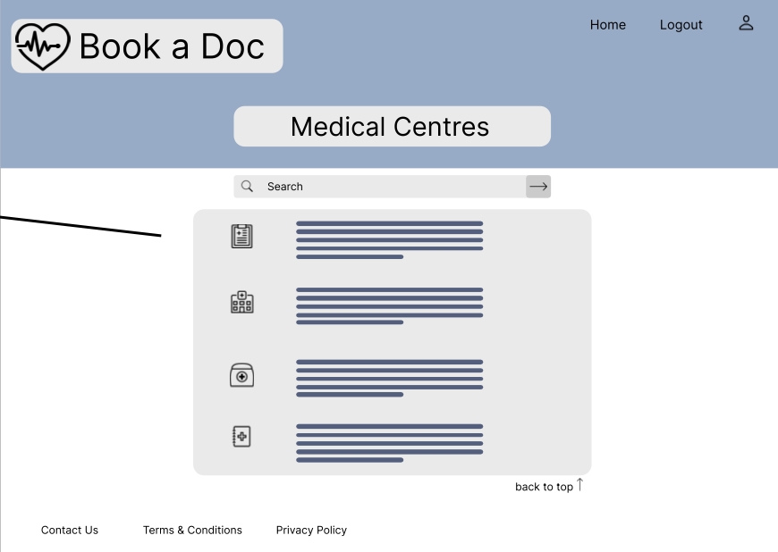

# Book-A-Doc Front End Web Application

## Pages
### **React Browser Tree**
* **HEADER**
  * Nav
    * About Us
    * Login
    * Sign up
      * Patient Sign Up
    * Logout _(auth)_
* **HOME/MAIN**
  * General Practitioners
    * Booking button _(auth)_
  * My Appointments _(auth)_
  * Medical Centres
    * Booking button _(auth)_
* **FOOTER**
  * Contact
  * Terms & Conditions
  * Privacy Policy

## Style Guide
* **font-family**: TBC
* **Colors**:
  * --primaryBG: white;
  * --secondaryBG: #9bb4ce;
  * --tertiaryBG: #e1e0e0;
  * --primaryFont: black;
  * --secondaryFont: #656464;

Header and feature components like buttons will be coloured with secondaryBG. Page banner and input fields will be coloured with tertiaryBG. Once links have been visited, they will be coloured with secondaryFont.

### Home

Patient can search for a GP or med centre without logging in. However if the patient wants to make a booking, a pop up will direct them to either log in or sign up.

---

### Patient Sign Up

---

### Patient Log In

If the user forgets their password, they can reset using their registered email.

Patients must enter a valid email and password. An eye icon exists to the right of the password input field to allow patients to unhide and hide their password if they choose.
---

### Patient Logged in

Once the patient has logged in, "My Appointments" will appear on the home page as an option. For new patients this section is blank until they have made their first appointment.
---

### General Practitioners

Each GP will have a profile:
- Name
- Specialty
- Medical Centre
- Available date and time
- Book button
---

### Medical Centres

Each medical centre will show:
- Medical centre name
- Address
- Contacts
- Opening hours
- List of Drs

Clicking on the Dr will bring the patient to the GP page to make a booking
---

### My Appointments

Each appointment will show:
* Date and time
* Dr Name
* Medical centre name
* Status which will show as either:
  * confirmed
  * completed, or
  * cancelled
* Cancel button
---

### Footer
The footer will have:
* **Contact**: Allow users of the site to contact Book-A-Doc
* **Terms & Conditions**: Listing all the T&C's for using the site
* **Privacy Policy**: Listing all the privacy policies on how Book-A-Doc handles user information
---

## Test List
* Page headings appearing in correct locations
* 
